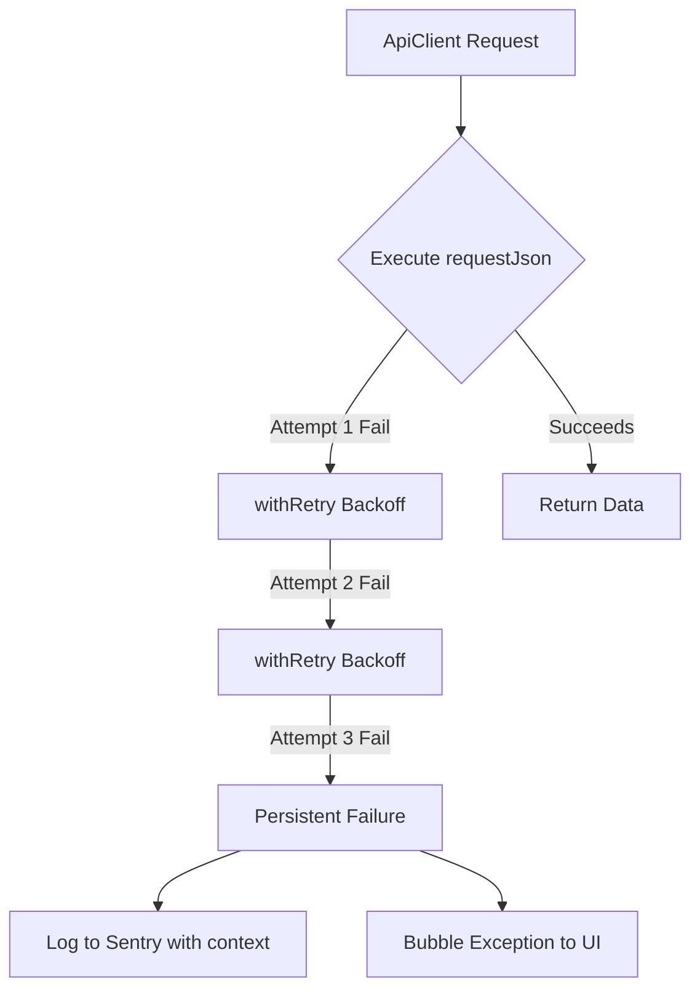

# Frontend Observability & Reliability Standards (Wave 5)

This document outlines the architecture, standards, and runtime strategies implemented to guarantee production-grade observability and network-level resilience for the SplitNaira frontend.

---

## 1. Centralized Observability & Telemetry

We utilize **Sentry** (`@sentry/nextjs`) as our central telemetry aggregator to capture React render errors, client-side runtime exceptions, Edge routing failures, and API interaction bugs.

### Configuration Topology
The Sentry agent is initialized across all target runtimes:
*   **Browser/Client (`sentry.client.config.ts`)**: Captures client-side React component crashes, user-triggered action exceptions, wallet hooks, and REST/RPC client network failures.
*   **Server Runtime (`sentry.server.config.ts`)**: Monitors Node.js server-side renders (SSR) and API routes execution.
*   **Edge Runtime (`sentry.edge.config.ts`)**: Observes Edge middleware and localized request proxying routes.

### PII & Security Redaction (Privacy Guardrail)
To ensure compliance and privacy, **all Stellar wallet addresses (G...) and smart contract IDs (C...)** are redacted from telemetry payloads before transmission.
*   **Rule:** Standard ed25519 public keys and contract IDs matching `\b[GC][A-Z2-7]{55}\b` are regex-replaced with `[WALLET_REDACTED]`.
*   **Location:** Configured globally inside `beforeSend` of the client initialization options.
*   **Bypass Control:** Standard environment configurations (`NEXT_PUBLIC_SENTRY_SCRUB_WALLET_ADDRESSES="false"`) allow disabling scrubbing only under local sandboxed debugging.

---

## 2. API resilience (Resilient Retries)

To mitigate transient network failures, latency spikes, or temporary backend drops, the frontend incorporates automated retries for all network interactions through `ApiClient`.

### Mechanics
*   **Target Scope:** Every JSON request orchestrated via `ApiClient.requestJson` (including project fetching, stats aggregation, allowlist lookup, and XDR compilation).
*   **Retry Policy:** up to **3 attempts** with a base backoff delay of **500ms** (exponential backoff).
*   **Error Logging:** Sentry logging is deferred to the final failure attempt. If the request succeeds during any retry, no error is sent to Sentry, avoiding alert noise.
*   **UI Graceful Degradation:** When all retries are exhausted, the error is bubbled up to the React layer, triggering the local `AppErrorBoundary` or displaying a user-friendly recovery toast.

---

## 3. Blockchain & Smart Contract Observability

On-chain operations require specialized telemetry to capture transaction assembly and execution anomalies.

### Soroban RPC Instrumentation
In `frontend/src/lib/soroban-transaction.ts`, we intercept transactions at two crucial stages:
1.  **Submission (`sendTransaction`)**:
    *   If the RPC node rejects the transaction (e.g., due to bad sequence numbers, fee mismatch, invalid signatures), Sentry captures the error accompanied by the `status` and `errorResult` XDR payload.
2.  **Polling (`pollTransaction`)**:
    *   **Failure State:** If the ledger executes the transaction but fails (e.g., contract panics, assertion failures), Sentry logs the error along with the transaction `resultXdr` to facilitate debugging.
    *   **Timeout State:** If the transaction is not confirmed within the threshold, Sentry receives a `poll` timeout event containing the transaction `hash` to investigate potential ledger congestion.

---

## 4. Wallet Connection Telemetry

User actions in `useWallet` hook (`connect` / `refresh` methods) log failed initialization triggers or connection blockages directly to Sentry (categorized under the `wallet-hook` tag). This ensures developers can monitor cross-browser/wallet driver bugs in real-time.

---

## 5. Deployment-Safe & Rollback Guidelines

### Pre-Deployment Verification Checklist
1.  **Verify Sentry Webpack Plugin:** During `npm run build`, verify that Next.js automatically generates and uploads source maps to Sentry. Ensure `SENTRY_AUTH_TOKEN` is configured in CI.
2.  **Validation Run:** Execute `npm run test` to verify retry policies and telemetry triggers.
3.  **Local Env Check:** Ensure `NEXT_PUBLIC_SENTRY_DSN` is correctly set in staging/production envs.

### Rollback Strategy
If telemetry issues cause performance degradation or memory leaks:
1.  **Observability Mute:** Unset `NEXT_PUBLIC_SENTRY_DSN` in Vercel settings and redeploy. Sentry will safely bypass initialization without breaking application logic.
2.  **Telemetry Scrubbing Rollback:** If the regex scrubber causes CPU overhead, set `NEXT_PUBLIC_SENTRY_SCRUB_WALLET_ADDRESSES="false"` to bypass redaction.
3.  **Network Revert:** To rollback API changes, revert the deployment to the previous stable Vercel deployment tag.